## Research motivation: Policy needs counterfactuals {.smaller}

**Core challenge**

- Policymakers need to reason about alternative interventions
- Social systems are hard to randomise cleanly
- Outcomes depend on **heterogeneity, interaction, and feedback**

<br>

**Possible solution: ABMs**

- They provide a computational laboratory for counterfactual policy analysis
- But aggregate fit alone does not identify the right **micro-mechanism**

<br>

**LLMs as the micro-mechanism?**

- They promise richer behavioural rules
- But that promise must be tested

::: {.notes}
Policy design is fundamentally counterfactual. In social sciences, clean experiments are rare. ABMs can move this logic into computation, but they face the identification problem: aggregate fit doesn't guarantee correct micro-mechanisms.
:::


<!-- ============================================= -->
<!-- SLIDE 3: THESIS PROPOSAL - PIPELINE -->
<!-- ============================================= -->

## Thesis proposal: from empirical backbone to validation and simulation {.pipeline-slide}

```{=html}
<div class="pipeline-fork">
  <div class="pipeline-card pipeline-card-blue pipeline-card-source">
    <div class="pipeline-title">1. Empirical backbone</div>
    <div class="pipeline-body">survey micro-data<br>→ theory-guided blocks<br>→ behavioural relationships</div>
  </div>

  <div class="pipeline-fork-svg" aria-hidden="true">
    <svg viewBox="0 0 180 240" preserveAspectRatio="none">
      <path d="M 0 120 L 72 120 L 72 40 L 180 40" />
      <path d="M 72 120 L 72 200 L 180 200" />
    </svg>
  </div>

  <div class="pipeline-branches">
    <div class="pipeline-card pipeline-card-mid">
      <div class="pipeline-title">2a. Survey-grounded ABM</div>
      <div class="pipeline-body">empirical relationships as behavioural core<br>→ social interaction<br>→ epidemic feedback<br>→ policy comparison</div>
    </div>

    <div class="pipeline-card pipeline-card-light">
      <div class="pipeline-title">2b. LLM micro-validation</div>
      <div class="pipeline-body">empirical benchmark for candidate behavioural components<br>→ baseline reconstruction<br>→ controlled perturbation tests</div>
    </div>
  </div>
</div>
```


<!-- ============================================= -->
<!-- SLIDE 4: EMPIRICAL BACKBONE - DATA -->
<!-- ============================================= -->

## Empirical backbone: Data and outcomes {.backbone-slide}

```{=html}
<div class="backbone-grid">
  <div class="backbone-panel">
    <div class="backbone-panel-title">Survey base</div>
    <div class="backbone-structured-text">
      <div class="backbone-text-section">
        <div class="backbone-text-label">Sample</div>
        <div class="backbone-text-content">~22,000 respondents · 6 European countries · 2024 survey wave</div>
      </div>
      <div class="backbone-text-section">
        <div class="backbone-text-label">Countries</div>
        <div class="backbone-text-content">Italy, Spain, France, Germany, Hungary, UK</div>
      </div>
      <div class="backbone-text-section">
        <div class="backbone-text-label">Survey domains</div>
        <div class="backbone-text-content">Demographics, health, vaccine beliefs, information environment, social exposure, trust, barriers, moral orientation</div>
      </div>
    </div>
  </div>

  <div class="backbone-panel">
    <div class="backbone-panel-title">Core prevention outcomes</div>
    <table class="backbone-outcomes-table">
      <thead>
        <tr>
          <th>Outcome</th>
          <th>Description</th>
        </tr>
      </thead>
      <tbody>
        <tr>
          <td>COVID vaccination willingness</td>
          <td>first/second dose phase</td>
        </tr>
        <tr>
          <td>Flu vaccination</td>
          <td>2023/2024 uptake</td>
        </tr>
        <tr>
          <td>NPI behaviours</td>
          <td>
            <ul class="backbone-compact-list">
              <li>masking when symptomatic</li>
              <li>staying home when symptomatic</li>
              <li>masking under high epidemic pressure</li>
            </ul>
          </td>
        </tr>
      </tbody>
    </table>
  </div>
</div>
```


<!-- ============================================= -->
<!-- SLIDE 5: EMPIRICAL BACKBONE - METHOD -->
<!-- ============================================= -->

## Empirical backbone: From survey items to reference models {.compact-backbone-slide}

```{=html}
<div class="compact-backbone-grid">
  <div class="compact-backbone-panel">
    <div class="compact-backbone-title">Reduction pipeline</div>
    <div class="compact-pipeline">
      <div class="compact-pipeline-step">
        <div class="compact-pipeline-box">Raw survey items</div>
      </div>
      <div class="compact-pipeline-step fragment fade-up" data-fragment-index="1">
        <div class="compact-pipeline-arrow compact-pipeline-arrow-above">↓</div>
        <div class="compact-pipeline-box">Derived variables and indices</div>
      </div>
      <div class="compact-pipeline-step fragment fade-up" data-fragment-index="2">
        <div class="compact-pipeline-arrow compact-pipeline-arrow-above">↓</div>
        <div class="compact-pipeline-box compact-pipeline-box-source">Theory-guided blocks</div>
      </div>
      <div class="compact-pipeline-step fragment fade-up" data-fragment-index="3">
        <div class="compact-pipeline-arrow compact-pipeline-arrow-above">↓</div>
        <div class="compact-pipeline-box">Importance screening</div>
      </div>
      <div class="compact-pipeline-step fragment fade-up" data-fragment-index="4">
        <div class="compact-pipeline-arrow compact-pipeline-arrow-above">↓</div>
        <div class="compact-pipeline-box compact-pipeline-box-accent">Final reference models</div>
      </div>
    </div>
  </div>

  <div class="compact-backbone-panel compact-blocks-panel fragment fade-in" data-fragment-index="2">
    <div class="compact-backbone-title">Theory-guided blocks</div>
    <div class="compact-blocks-grid">
      <div class="compact-block-item">
        <div class="compact-block-name">Institutional trust</div>
        <div class="compact-block-desc">Trust in vaccine information from institutions and experts</div>
      </div>
      <div class="compact-block-item">
        <div class="compact-block-name">CoVax legitimacy</div>
        <div class="compact-block-desc">Legitimacy of vaccination governance</div>
      </div>
      <div class="compact-block-item">
        <div class="compact-block-name">Disposition (5C)</div>
        <div class="compact-block-desc">Baseline pro-vaccine disposition</div>
      </div>
      <div class="compact-block-item">
        <div class="compact-block-name">Stakes</div>
        <div class="compact-block-desc">Perceived disease stakes</div>
      </div>
      <div class="compact-block-item">
        <div class="compact-block-name">Norms</div>
        <div class="compact-block-desc">Perceived vaccination norms</div>
      </div>
      <div class="compact-block-item">
        <div class="compact-block-name">Moral orientation</div>
        <div class="compact-block-desc">Moral-ideological orientation</div>
      </div>
      <div class="compact-block-item">
        <div class="compact-block-name">Habit</div>
        <div class="compact-block-desc">Behavioural inertia</div>
      </div>
      <div class="compact-block-item">
        <div class="compact-block-name">Controls</div>
        <div class="compact-block-desc">Demographic and socioeconomic background</div>
      </div>
    </div>
  </div>
</div>
```


<!-- ============================================= -->
<!-- SLIDE 6: EMPIRICAL RESULTS - BLOCK IMPORTANCE -->
<!-- ============================================= -->

## Empirical results: Shared blocks, different importance {.empirical-heatmap-slide}

```{=html}
<div class="empirical-heatmap-grid">
  <div class="empirical-heatmap-figure-panel">
    <div class="empirical-heatmap-figure-wrap">
      <div class="empirical-heatmap-image-stack">
        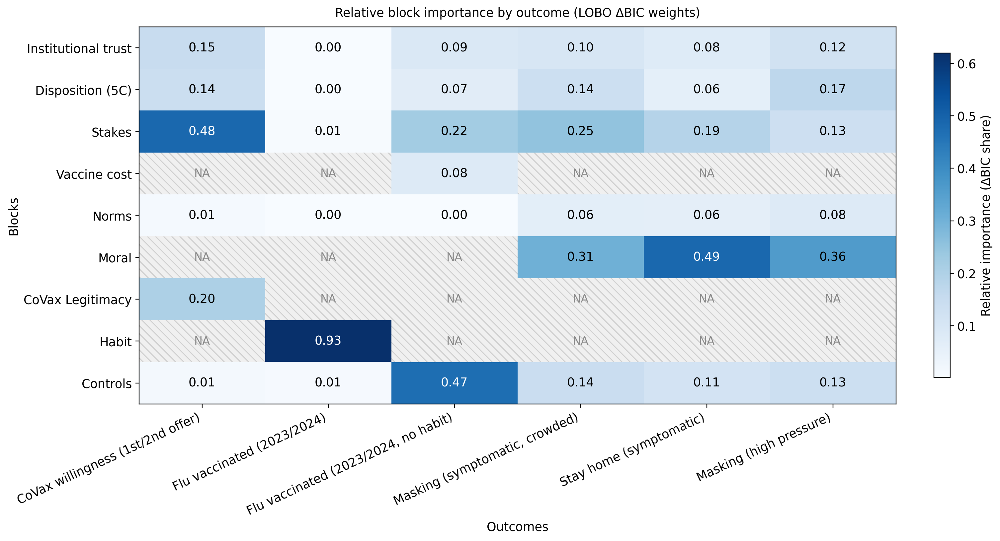
        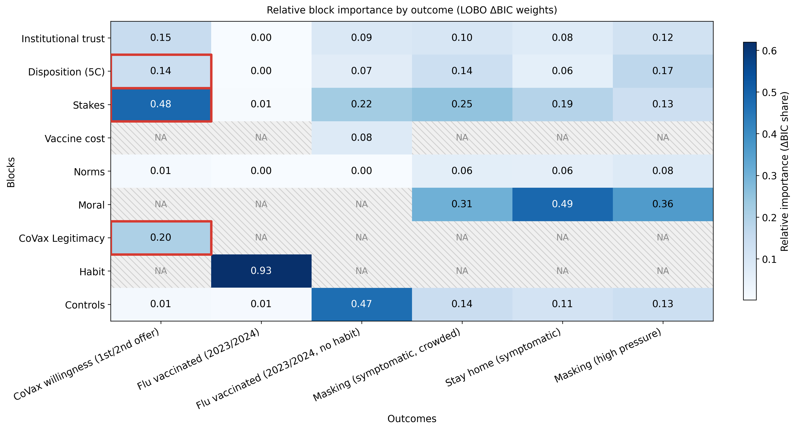
        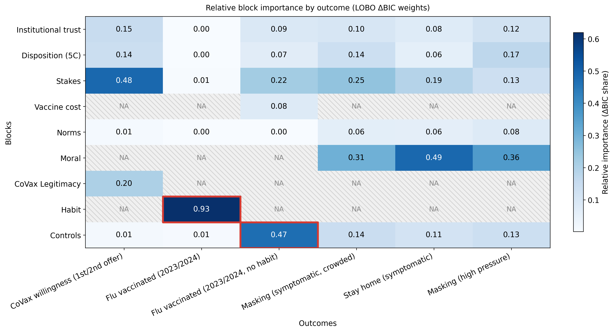
        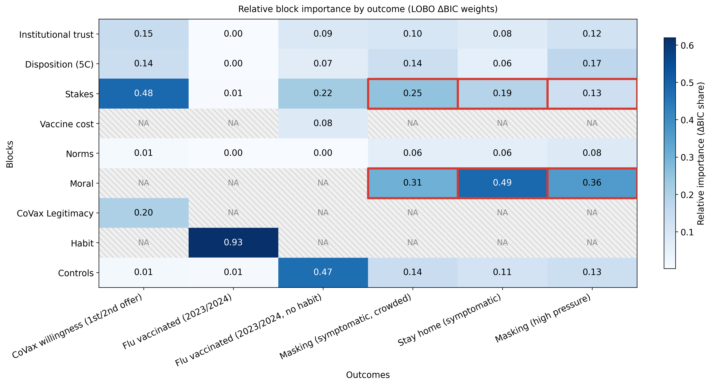
      </div>
    </div>
  </div>

  <div class="empirical-heatmap-takeaways">
    <div class="empirical-heatmap-takeaway empirical-heatmap-takeaway-covid">
      <div class="empirical-heatmap-takeaway-focus fragment current-visible" data-fragment-index="1" aria-hidden="true"></div>
      <span class="empirical-heatmap-label">COVID vaccination willingness:</span>
      stakes, with trust, legitimacy, and disposition also contributing
    </div>
    <div class="empirical-heatmap-takeaway empirical-heatmap-takeaway-flu">
      <div class="empirical-heatmap-takeaway-focus fragment current-visible" data-fragment-index="2" aria-hidden="true"></div>
      <span class="empirical-heatmap-label">Flu vaccination:</span>
      dominated by habit; without inertia, controls still retain signal
    </div>
    <div class="empirical-heatmap-takeaway empirical-heatmap-takeaway-npi">
      <div class="empirical-heatmap-takeaway-focus fragment fade-in" data-fragment-index="3" aria-hidden="true"></div>
      <span class="empirical-heatmap-label">NPIs:</span>
      moral orientation, with stakes still relevant
    </div>
  </div>
</div>
```


<!-- ============================================= -->
<!-- SLIDE 7: EMPIRICAL RESULTS - PERTURBATION -->
<!-- ============================================= -->

## Empirical results: Which blocks increase prevention most? {.perturbation-slide}

```{=html}
<div class="perturbation-slide-grid">
  <div class="perturbation-slide-explainer"><strong>The figure shows the fitted change</strong> in each prevention outcome when <strong>one retained block</strong> is shifted, <strong>one at a time</strong>, from a realistic low to a realistic high value, <strong>holding the rest of the profile fixed</strong>.</div>

  <div class="perturbation-slide-figure-wrap">
    <div class="perturbation-slide-figure-stack">
      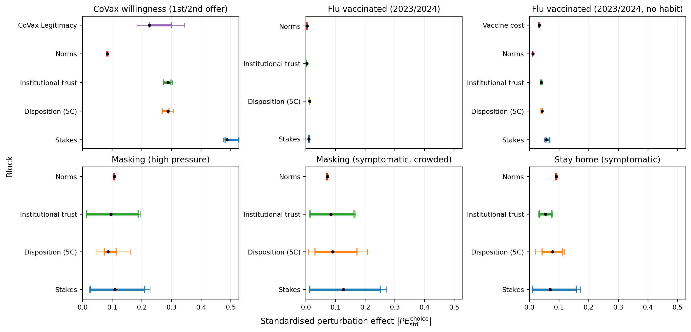
      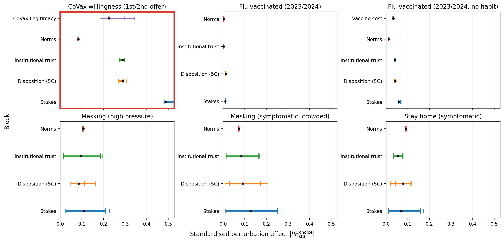
      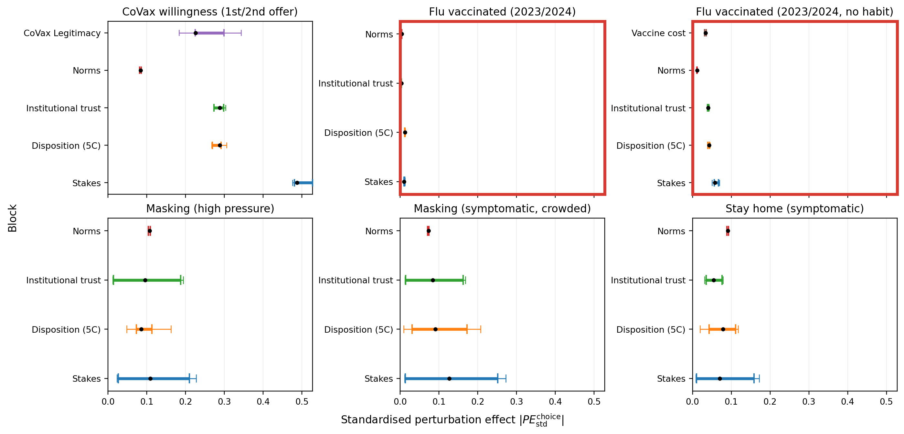
      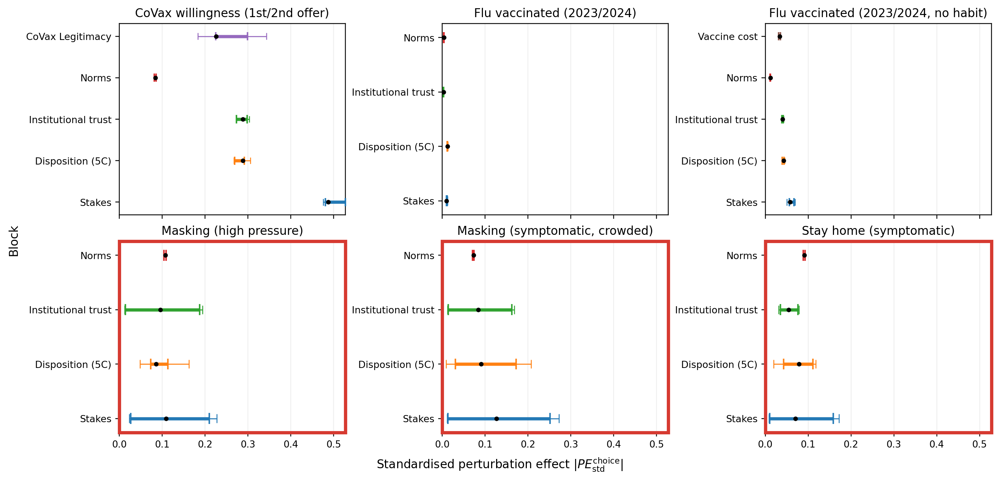
    </div>
  </div>

  <div class="perturbation-slide-takeaways">
    <div class="perturbation-slide-takeaway perturbation-slide-takeaway-covid">
      <span class="perturbation-slide-label">COVID willingness:</span>
      stakes show the largest fitted shift
    </div>
    <div class="perturbation-slide-takeaway perturbation-slide-takeaway-flu">
      <span class="perturbation-slide-label">Flu vaccination:</span>
      short-run leverage is limited because behaviour is habit-driven
    </div>
    <div class="perturbation-slide-takeaway perturbation-slide-takeaway-npi">
      <span class="perturbation-slide-label">NPIs:</span>
      effects are more dispersed because headroom differs across profiles
    </div>
    <div class="perturbation-slide-takeaway-focus perturbation-slide-takeaway-focus-covid fragment current-visible" data-fragment-index="1" aria-hidden="true"></div>
    <div class="perturbation-slide-takeaway-focus perturbation-slide-takeaway-focus-flu fragment current-visible" data-fragment-index="2" aria-hidden="true"></div>
    <div class="perturbation-slide-takeaway-focus perturbation-slide-takeaway-focus-npi fragment fade-in" data-fragment-index="3" aria-hidden="true"></div>
  </div>
</div>
```


<!-- ============================================= -->
<!-- SLIDE 12: ABM ARCHITECTURE -->
<!-- ============================================= -->

## ABM architecture: From survey gradients to dynamics {.abm-bridge-slide}

::: {.abm-bridge-challenge}
**Challenge:** the survey anchors behavioural gradients, but the ABM must supply the update rule.
:::

:::: {.abm-structure}

:::: {.abm-bridge-layout}

::: {.abm-node .abm-equations-node}
Survey-grounded equations
:::

::: {.abm-arrow .abm-arrow-bridge-left}
→
:::

::: {.abm-dynamic-bridge-box}
<div class="abm-dynamic-bridge-title">Dynamic bridge</div>

:::: {.abm-dynamic-bridge-inner}

::: {.abm-node .abm-node-large .abm-adjust-node}
**Partial adjustment toward time-varying targets**

$$
s_{i,u}(t+1)=s_{i,u}(t)+\kappa_u\big(\tilde{s}_{i,u}(t)-s_{i,u}(t)\big)
$$

::: {.abm-adjust-kappa-note}
::: {.abm-adjust-kappa-set}
$\kappa_u \in \{k_{\text{slow}}, k_{\text{fast}}\}$
:::

::: {.abm-adjust-kappa-map}
$k_{\text{slow}}$: trust, norms · $k_{\text{fast}}$: situational risk
:::
:::
:::

::: {.abm-side-box .abm-side-social}
**Social influence**

- peer pull
- norm updating
:::

::: {.abm-side-box .abm-side-incidence}
**Incidence feedback**

- protection lowers incidence
- incidence raises perceived risk

Behaviour → incidence → risk-related targets
:::

::::
:::

::: {.abm-arrow .abm-arrow-bridge-right}
→
:::

::: {.abm-node .abm-outcomes-node}
Behavioural outcomes
:::

::::

::::


<!-- ============================================= -->
<!-- SLIDE 9: ABM DYNAMICS -->
<!-- ============================================= -->

## ABM results: Similar cumulative effects can hide different dynamics {.abm-dynamics-slide}

```{=html}
<div class="abm-dynamics-grid">
```

::: {.abm-slide-subtitle}
Each row is a different lever; each column shows how its effects propagate over time.
:::

```{=html}
<div class="abm-dynamics-main">
  <div class="abm-dynamics-figure-wrap">
    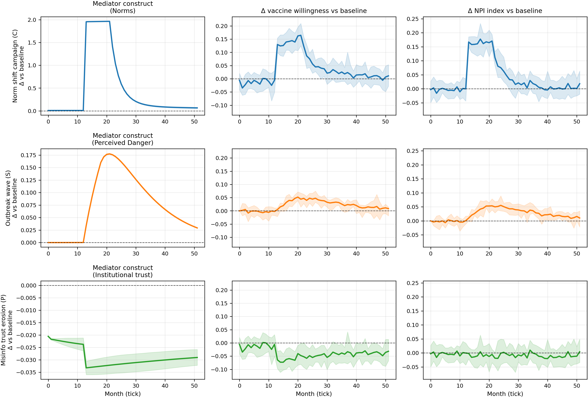
  </div>
  <div class="abm-dynamics-side">
    <div class="abm-dynamics-side-item">
      <div class="abm-dynamics-side-title">Norm campaign</div>
      <div class="abm-dynamics-side-text">Longest behavioural tail, sustained by social reinforcement.</div>
    </div>
    <div class="abm-dynamics-side-item">
      <div class="abm-dynamics-side-title">Outbreak wave</div>
      <div class="abm-dynamics-side-text">Wave-like rise, then faster relaxation as perceived risk fades.</div>
    </div>
    <div class="abm-dynamics-side-item">
      <div class="abm-dynamics-side-title">Trust erosion</div>
      <div class="abm-dynamics-side-text">The most persistent tail appears mainly in vaccination willingness.</div>
    </div>
  </div>
</div>
```

```{=html}
</div>
```


<!-- ============================================= -->
<!-- SLIDE 11: LLM EVALUATION - DESIGN -->
<!-- ============================================= -->

## LLM micro-validation: Can LLM agents reproduce the empirical benchmark? {.evaluation-design-slide}

```{=html}
<div class="evaluation-design-grid">
  <div class="evaluation-design-cards">
    <div class="evaluation-design-card">
      <div class="evaluation-design-card-title">Why this matters</div>
      <div class="evaluation-design-item">candidate behavioural components for the ABM</div>
      <div class="evaluation-design-item">usable only if they reproduce empirical patterns</div>
    </div>

    <div class="evaluation-design-card">
      <div class="evaluation-design-card-title">What is tested</div>
      <div class="evaluation-design-subsection">Behavioural outcomes</div>
      <div class="evaluation-design-item">at baseline</div>
      <div class="evaluation-design-item">under controlled shifts</div>
    </div>

    <div class="evaluation-design-card">
      <div class="evaluation-design-card-title">How performance is judged</div>
      <div class="evaluation-design-subsection">At baseline</div>
      <div class="evaluation-design-item">level and rank recovery</div>
      <div class="evaluation-design-subsection">Under controlled shifts</div>
      <div class="evaluation-design-item">who moves, how much, and whether irrelevant shifts stay small</div>
    </div>
  </div>
</div>
```


<!-- ============================================= -->
<!-- SLIDE 12: LLM RESULTS - BASELINE -->
<!-- ============================================= -->

## LLM micro-validation: Baseline structure is partly recovered {.baseline-synthesis-slide}

```{=html}
<div class="baseline-synthesis-table">
  <div class="baseline-synthesis-footnote">
    <span><strong>Gini (rank recovery):</strong> 1 = perfect ordering, 0 = no rank recovery</span>
    <span><strong>Skill (level recovery):</strong> 1 = perfect, 0 = baseline (median or majority), &lt; 0 = worse</span>
  </div>
  <table class="baseline-synthesis-metrics">
    <colgroup>
      <col class="baseline-synthesis-outcome-col" />
      <col class="baseline-synthesis-number-col" />
      <col class="baseline-synthesis-number-col" />
      <col class="baseline-synthesis-number-col" />
      <col class="baseline-synthesis-number-col" />
    </colgroup>
    <thead>
      <tr>
        <th rowspan="2">Outcome</th>
        <th colspan="2">Rank recovery (Gini)</th>
        <th colspan="2">Level recovery (Skill)</th>
      </tr>
      <tr>
        <th>LLM</th>
        <th>Empirical ref.</th>
        <th>LLM</th>
        <th>Empirical ref.</th>
      </tr>
    </thead>
    <tbody>
      <tr>
        <td>CoVax willingness</td>
        <td class="baseline-synthesis-llm-value">0.45</td>
        <td class="baseline-synthesis-reference-value">0.67</td>
        <td class="baseline-synthesis-llm-value">0.27</td>
        <td class="baseline-synthesis-reference-value">0.43</td>
      </tr>
      <tr>
        <td>Flu vaccinated (no habit)</td>
        <td class="baseline-synthesis-llm-value">0.31</td>
        <td class="baseline-synthesis-reference-value">0.64</td>
        <td class="baseline-synthesis-llm-value">-0.40</td>
        <td class="baseline-synthesis-reference-value">-0.26</td>
      </tr>
      <tr>
        <td>Masking (high pressure)</td>
        <td class="baseline-synthesis-llm-value">0.27</td>
        <td class="baseline-synthesis-reference-value">0.44</td>
        <td class="baseline-synthesis-llm-value">0.07</td>
        <td class="baseline-synthesis-reference-value">0.16</td>
      </tr>
      <tr>
        <td>Masking (symptomatic, crowded)</td>
        <td class="baseline-synthesis-llm-value">0.21</td>
        <td class="baseline-synthesis-reference-value">0.38</td>
        <td class="baseline-synthesis-llm-value">0.05</td>
        <td class="baseline-synthesis-reference-value">0.14</td>
      </tr>
      <tr>
        <td>Stay home (symptomatic)</td>
        <td class="baseline-synthesis-llm-value">0.15</td>
        <td class="baseline-synthesis-reference-value">0.32</td>
        <td class="baseline-synthesis-llm-value">-0.02</td>
        <td class="baseline-synthesis-reference-value">0.07</td>
      </tr>
    </tbody>
  </table>
</div>
```


<!-- ============================================= -->
<!-- SLIDE 13: LLM RESULTS - COUNTERFACTUAL BREAKDOWN -->
<!-- ============================================= -->

## LLM micro-validation: The model does not respond coherently to block shifts {.perturbed-results-slide}

```{=html}
<div class="perturbed-results-top">
  <div class="perturbed-results-subtitle">
    Under the same block shifts used in the empirical benchmark, the model often overreacts or underreacts, making it unreliable for use in an ABM.
  </div>
</div>

<div class="perturbed-results-single">
  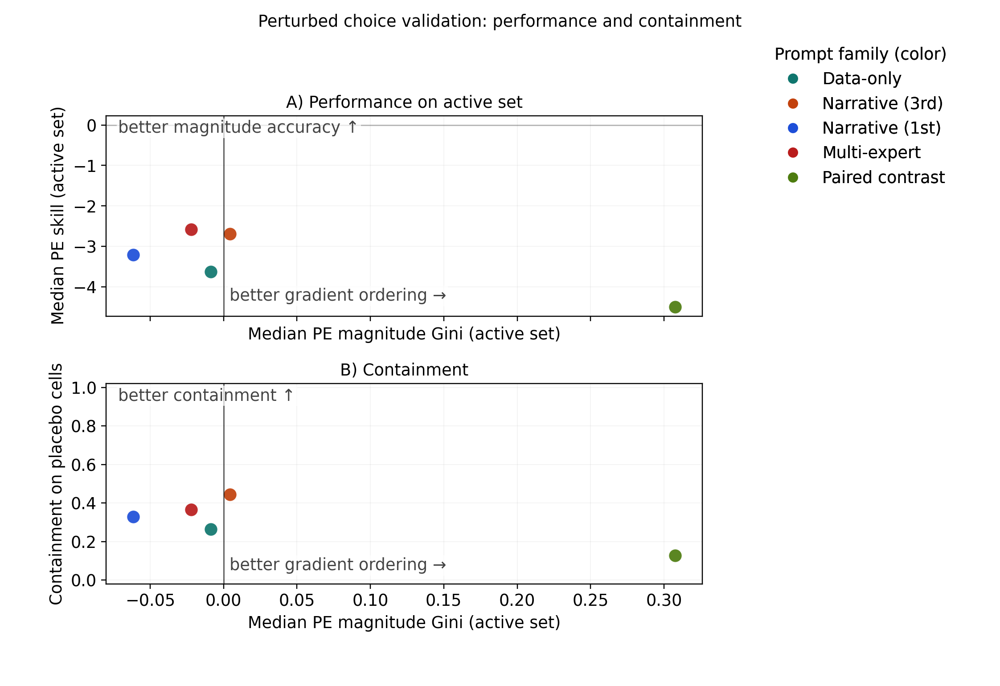
  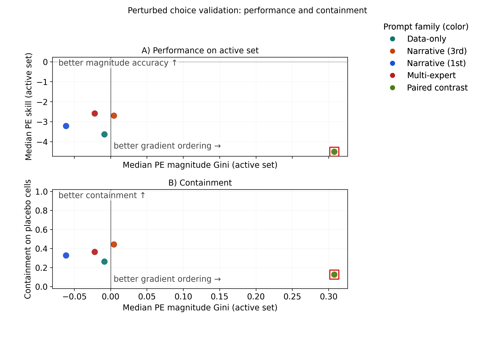
</div>
```


<!-- ============================================= -->
<!-- SLIDE 14: TAKEAWAYS -->
<!-- ============================================= -->

## Takeaways {.takeaways-slide}

```{=html}
<div class="takeaways-layout">
  <div class="takeaways-main">
```

::: {.takeaway .takeaway-final}
**1. Prevention is compact, but outcome-specific**

The same broad engines recur across outcomes, but their behavioural weights change.
:::

::: {.takeaway .takeaway-final}
**2. LLMs recover baselines better than counterfactuals**

Static plausibility is not enough when behavioural responses must remain coherent under perturbation.
:::

::: {.takeaway .takeaway-final}
**3. Dynamics re-rank the policy levers**

The strongest one-step lever is not always the strongest cumulative lever.
:::

```{=html}
  </div>
  <div class="takeaways-next-step">
    <div class="takeaways-next-step-label">Next step</div>
    <div class="takeaways-next-step-text">Longitudinal evidence on within-person dynamics, plus a richer transmission layer.</div>
  </div>
</div>
```

<!-- ============================================= -->
<!-- BACKUP SLIDES -->
<!-- ============================================= -->

## Thank you {#thank-you .thank-you-slide background-color="#fafbfc"}

::: {.thank-you-slide-inner}
Thank you
:::

## {.center background-color="#1e3a5f"}

::: {style="color: white; font-size: 1.5em; text-align: center;"}
**Backup Slides**
:::


<!-- ============================================= -->
<!-- BACKUP: BLOCK DICTIONARY -->
<!-- ============================================= -->

## Construct dictionary {.smaller}

::: {.backup-marker}
BACKUP
:::

| Construct | What it captures | Example components |
|---|---|---|
| **Stakes** | Perceived disease threat and exposure | perceived danger, vulnerability, infection likelihood, fear |
| **Institutional trust** | Confidence in public-health and scientific institutions | trust in government, health authorities, science |
| **Legitimacy** | Acceptance of the policy process and rollout | fairness of decisions, acceptance of governance and mandates |
| **Disposition** | General vaccine orientation | vaccine confidence, perceived vaccine risk/cost, general attitudes |
| **Habit** | Inertia from past preventive behaviour | prior flu vaccination, routine uptake |
| **Moral orientation** | Prosocial vs authority/binding framing | individualising and binding moral foundations |
| **Norms** | Perceived prevalence and social expectations | what others do, what others approve of |
| **Controls / constraints** | Background and practical conditions shaping feasible action | age, health, access barriers, household and socioeconomic conditions |

::: {style="margin-top: 0.7rem; padding: 0.45rem 0.6rem; border-left: 3px solid #5b92c8; background: rgba(232, 240, 247, 0.45); font-size: 0.72em; line-height: 1.3;"}
**Key distinction**

**Trust** = confidence in institutions  
**Legitimacy** = acceptance of the policy process  
**Disposition** = orientation toward the vaccine itself
:::


<!-- ============================================= -->
<!-- BACKUP: ABM INTERVENTIONS -->
<!-- ============================================= -->

## ABM results: Dynamics re-rank the policy levers {.abm-leaderboard-slide}

::: {.backup-marker}
BACKUP
:::

::: {.abm-slide-subtitle}
The strongest one-step lever is not always the strongest cumulative lever.
:::

::: {.abm-technical-note}
C = 9-month campaign · S = 6-month outbreak wave · P = 1-tick pulse
:::

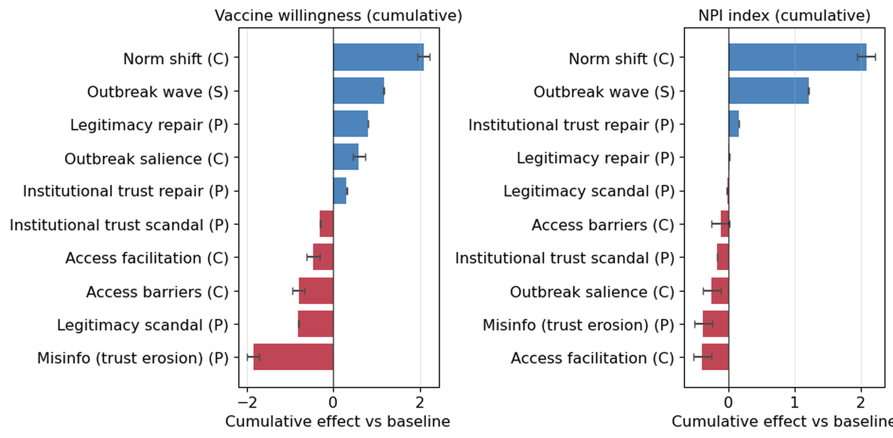{.abm-leaderboard-figure}

::: {.abm-side-takeaways}
::: {.abm-takeaway}
**Norm shift:** strongest cumulative lever.
:::

::: {.abm-takeaway}
**Credibility:** legitimacy is vaccine-specific; trust is broader.
:::

::: {.abm-takeaway}
**Access facilitation:** can reverse through incidence feedback.
:::
:::


<!-- ============================================= -->
<!-- BACKUP: LLM EVALUATION DETAILS -->
<!-- ============================================= -->

## LLM evaluation: Prompt strategies {.smaller visibility="hidden"}

::: {.backup-marker}
BACKUP
:::

:::: {.columns}

::: {.column width="50%"}

**Prompting variants tested:**

- Zero-shot description
- Profile-with-demographics
- Chain-of-thought reasoning
- Paired comparison (explicit contrast)

<br>

**Models evaluated:**

- GPT-4 / GPT-3.5
- Claude variants
- Open-source alternatives

:::

::: {.column width="50%"}

**Metrics:**

| Metric | Measures |
|--------|----------|
| MAE | Level accuracy |
| Spearman ρ | Rank agreement |
| Calibration slope | Compression degree |
| Paired accuracy | Contrast discrimination |

<br>

::: {.muted}
Full results in appendix
:::

:::

::::


<!-- ============================================= -->
<!-- BACKUP: LLM RESULTS - MISPLACED MECHANISM -->
<!-- ============================================= -->

## LLM micro-validation: The mechanism is misplaced {.mechanism-slide}

::: {.backup-marker}
BACKUP
:::

```{=html}
<div class="mechanism-slide-top">
  <div class="mechanism-slide-subtitle">
    Under perturbation, responses are not only mis-scaled; they are assigned to the wrong levers and spread too broadly.
  </div>
</div>

<div class="mechanism-slide-grid">
  <div class="mechanism-slide-panel">
    <div class="mechanism-slide-label">Behavioural perturbations</div>
    <div class="mechanism-slide-callout">Stakes underweighted; trust / legitimacy relatively overweighted</div>
    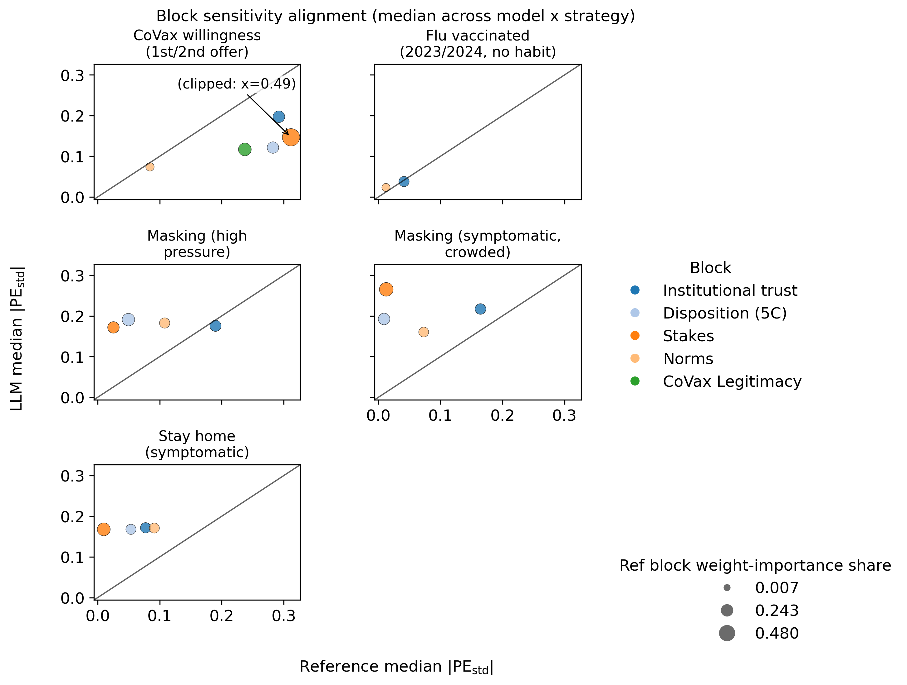
  </div>

  <div class="mechanism-slide-panel">
    <div class="mechanism-slide-label">Profile perturbations</div>
    <div class="mechanism-slide-callout">All blocks above the diagonal → systematic oversensitivity</div>
    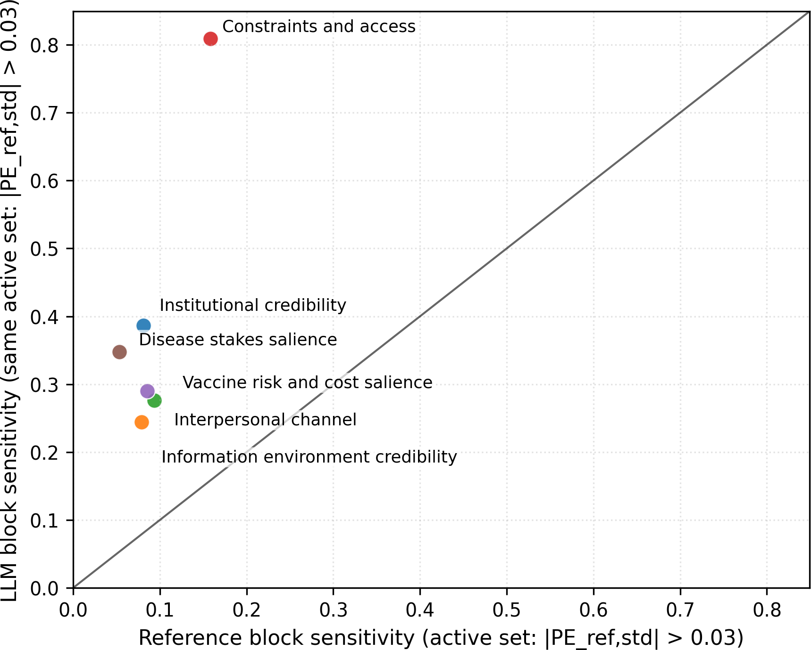
  </div>
</div>
```


<!-- ============================================= -->
<!-- BACKUP: ABM EQUATIONS -->
<!-- ============================================= -->

## ABM equations: Partial adjustment {.smaller visibility="hidden"}

::: {.backup-marker}
BACKUP
:::

**State update:**

$$
s_{i,u}(t+1) = s_{i,u}(t) + \kappa_u\big(\tilde s_{i,u}(t)-s_{i,u}(t)\big)
$$

where $\kappa_u \in \{k_{\text{fast}}, k_{\text{slow}}\}$

<br>

**Target composition:**

$$
\tilde s_{i,u}(t) = s_{i,u}^{\text{base}} + \Delta^{\text{policy}}(t) + \Delta^{\text{social}}(t) + \Delta^{\text{incidence}}(t)
$$

<br>

**Norm updating (threshold):**

$$
\text{norm}_{i}(t+1) = \text{norm}_{i}(t) + \alpha_i \cdot \mathbb{1}\left[\text{observed} > \theta_i\right] \cdot g(\text{observed})
$$


<!-- ============================================= -->
<!-- BACKUP: MORRIS SENSITIVITY -->
<!-- ============================================= -->

## Sensitivity analysis: Robustness depends on different mechanisms {.abm-sensitivity-slide}

::: {.backup-marker}
BACKUP
:::

```{=html}
<div class="abm-sensitivity-grid">
```

::: {.abm-slide-subtitle}
Read across rows: brighter cells mark where sensitivity is concentrated within each scenario–outcome pair.
:::

```{=html}
<div class="abm-sensitivity-main">
  <div class="abm-sensitivity-figure-wrap">
    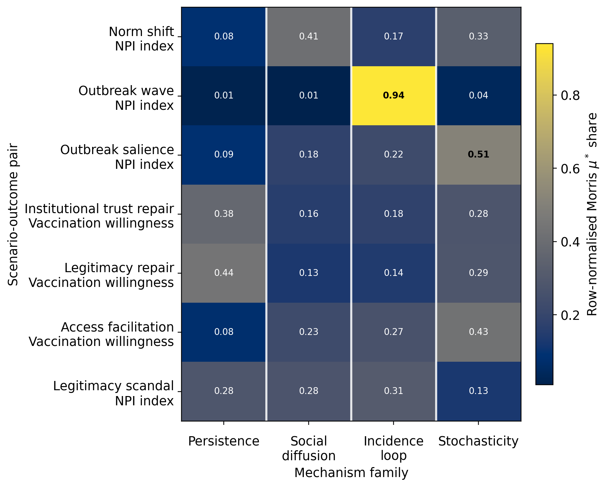
  </div>
  <div class="abm-sensitivity-side">
    <div class="abm-sensitivity-side-item abm-sensitivity-side-item-persistence">
      <div class="abm-sensitivity-side-title">Credibility repair</div>
      <div class="abm-sensitivity-side-text">Both repair scenarios load mainly on <strong>persistence</strong> (0.38, 0.44), so robustness depends on slow trust and legitimacy relaxation.</div>
    </div>
    <div class="abm-sensitivity-side-item abm-sensitivity-side-item-diffusion">
      <div class="abm-sensitivity-side-title">Norm shift</div>
      <div class="abm-sensitivity-side-text">Sensitivity concentrates in <strong>social diffusion</strong> (0.41), with <strong>stochasticity</strong> also relevant (0.33).</div>
    </div>
    <div class="abm-sensitivity-side-item abm-sensitivity-side-item-incidence">
      <div class="abm-sensitivity-side-title">Outbreak wave</div>
      <div class="abm-sensitivity-side-text">Sensitivity is almost entirely <strong>incidence-loop</strong> driven (0.94), consistent with a risk-salience shock.</div>
    </div>
  </div>
</div>
```

```{=html}
</div>
```

## Morris sensitivity: Full results {.smaller visibility="hidden"}

::: {.backup-marker}
BACKUP
:::

**Elementary effects screening:**

- Parameter space partitioned into mechanism families
- μ* captures average absolute effect
- σ captures interaction/non-linearity

<br>

**Key insights:**

1. Credibility interventions → persistence parameters dominate
2. Norm interventions → social diffusion parameters dominate
3. Access interventions → mixed (incidence + stochastic)
4. Cumulative AUC rankings more stable than point-in-time rankings

::: {.muted}
Confirms that intervention types work through distinct mechanisms, and that model structure drives the differentiation
:::
