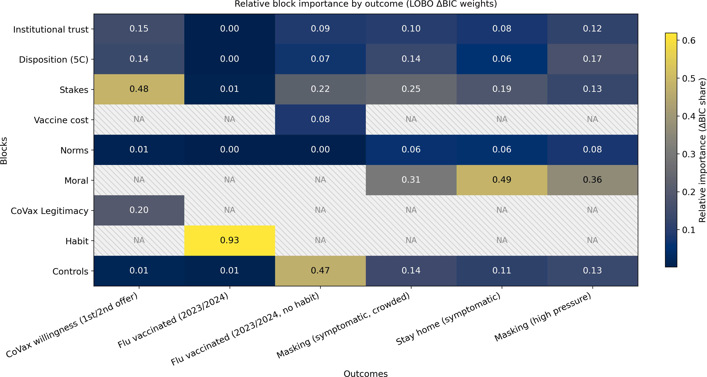
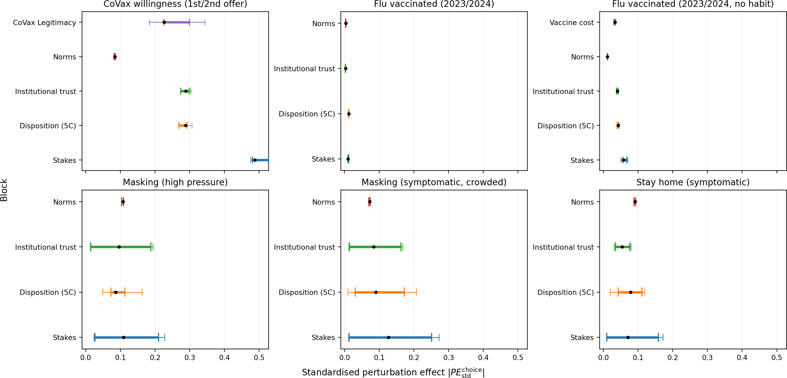
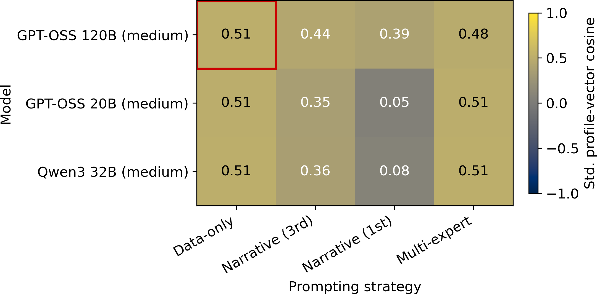
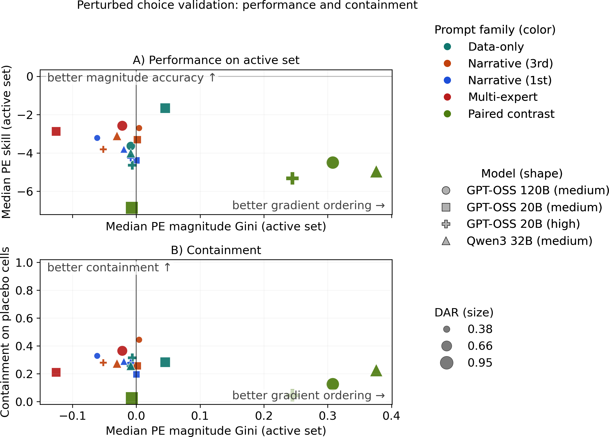
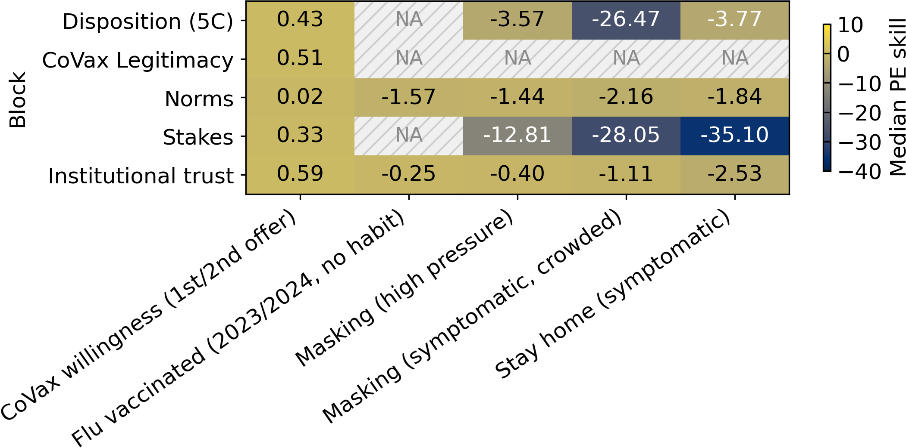
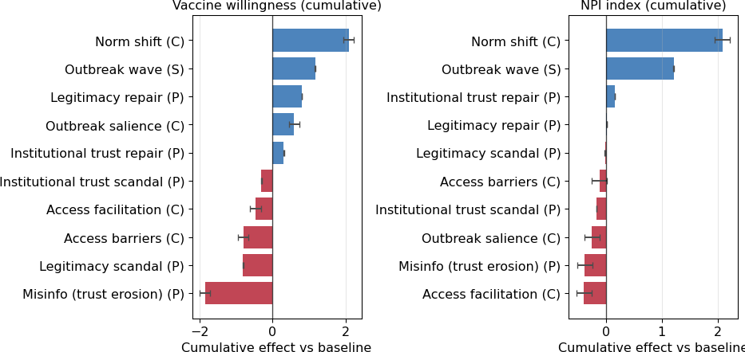

## Research motivation: Policy needs counterfactuals {.smaller}

**Core challenge**

- Policymakers need to reason about alternative interventions
- Social systems are hard to randomise cleanly
- Outcomes depend on **heterogeneity, interaction, and feedback**

<br>

**Possible solution: ABMs**

- They provide a computational laboratory for counterfactual policy analysis
- But aggregate fit alone does not identify the right **micro-mechanism**

<br>

**LLMs as the micro-mechanism?**

- They promise richer behavioural rules
- But that promise must be tested

::: {.notes}
Policy design is fundamentally counterfactual. In social sciences, clean experiments are rare. ABMs can move this logic into computation, but they face the identification problem: aggregate fit doesn't guarantee correct micro-mechanisms.
:::


<!-- ============================================= -->
<!-- SLIDE 3: THESIS PROPOSAL - PIPELINE -->
<!-- ============================================= -->

## Thesis Proposal: From empirics to simulation {.pipeline-slide}

```{=html}
<div class="pipeline-grid">
  <div class="pipeline-card pipeline-card-blue">
    <div class="pipeline-title">1. Empirical backbone</div>
    <div class="pipeline-body">survey micro-data<br>→ theory-guided blocks<br>→ reference equations</div>
  </div>

  <div class="pipeline-arrow">→</div>

  <div class="pipeline-card pipeline-card-mid">
    <div class="pipeline-title">2. LLM micro-validation</div>
    <div class="pipeline-body">• baseline reconstruction<br>• perturbed response tests</div>
  </div>

  <div class="pipeline-arrow">→</div>

  <div class="pipeline-card pipeline-card-light">
    <div class="pipeline-title">3. Survey-grounded ABM</div>
    <div class="pipeline-body">• social interaction<br>• epidemic feedback<br>→ policy comparison</div>
  </div>
</div>
```


<!-- ============================================= -->
<!-- SLIDE 4: EMPIRICAL BACKBONE - DATA -->
<!-- ============================================= -->

## Empirical backbone: Data and outcomes {.backbone-slide}

```{=html}
<div class="backbone-grid">
  <div class="backbone-panel">
    <div class="backbone-panel-title">Survey base</div>
    <div class="backbone-structured-text">
      <div class="backbone-text-section">
        <div class="backbone-text-label">Sample</div>
        <div class="backbone-text-content">~22,000 respondents · 6 European countries · 2024 survey wave</div>
      </div>
      <div class="backbone-text-section">
        <div class="backbone-text-label">Countries</div>
        <div class="backbone-text-content">Italy, Spain, France, Germany, Hungary, UK</div>
      </div>
      <div class="backbone-text-section">
        <div class="backbone-text-label">Survey domains</div>
        <div class="backbone-text-content">Demographics, health, vaccine beliefs, information environment, social exposure, trust, barriers, moral orientation</div>
      </div>
    </div>
  </div>

  <div class="backbone-panel">
    <div class="backbone-panel-title">Core prevention outcomes</div>
    <table class="backbone-outcomes-table">
      <thead>
        <tr>
          <th>Outcome</th>
          <th>Description</th>
        </tr>
      </thead>
      <tbody>
        <tr>
          <td>COVID vaccination willingness</td>
          <td>first/second dose phase</td>
        </tr>
        <tr>
          <td>Flu vaccination</td>
          <td>2023/2024 uptake</td>
        </tr>
        <tr>
          <td>NPI behaviours</td>
          <td>
            <ul class="backbone-compact-list">
              <li>masking when symptomatic</li>
              <li>staying home when symptomatic</li>
              <li>masking under high epidemic pressure</li>
            </ul>
          </td>
        </tr>
      </tbody>
    </table>
  </div>
</div>
```


<!-- ============================================= -->
<!-- SLIDE 5: EMPIRICAL BACKBONE - METHOD -->
<!-- ============================================= -->

## Empirical backbone: From survey to compact representation {.compact-backbone-slide}

```{=html}
<div class="compact-backbone-grid">
  <div class="compact-backbone-panel">
    <div class="compact-backbone-title">Reduction pipeline</div>
    <div class="compact-pipeline">
      <div class="compact-pipeline-step">
        <div class="compact-pipeline-box">Raw survey items</div>
      </div>
      <div class="compact-pipeline-arrow">↓</div>
      <div class="compact-pipeline-step">
        <div class="compact-pipeline-box">Survey-derived variables</div>
      </div>
      <div class="compact-pipeline-arrow">↓</div>
      <div class="compact-pipeline-step">
        <div class="compact-pipeline-box">Theory-guided blocks</div>
      </div>
      <div class="compact-pipeline-arrow">↓</div>
      <div class="compact-pipeline-step">
        <div class="compact-pipeline-box">Reference equations</div>
      </div>
      <div class="compact-pipeline-arrow">↓</div>
      <div class="compact-pipeline-step">
        <div class="compact-pipeline-box compact-pipeline-box-accent">Retained empirical backbone</div>
      </div>
    </div>
  </div>

  <div class="compact-backbone-panel">
    <div class="compact-backbone-title">Theory-guided blocks</div>
    <div class="compact-blocks-grid">
      <div class="compact-block-item">Stakes</div>
      <div class="compact-block-item">Trust</div>
      <div class="compact-block-item">Legitimacy</div>
      <div class="compact-block-item">Disposition</div>
      <div class="compact-block-item">Habit</div>
      <div class="compact-block-item">Moral orientation</div>
      <div class="compact-block-item">Controls</div>
      <div class="compact-block-item">Norms</div>
    </div>
    <div class="compact-backbone-goal"><span class="compact-backbone-goal-label">Goal:</span> a compact representation for <strong>LLM evaluation</strong> and <strong>ABM simulation</strong>.</div>
  </div>
</div>
```


<!-- ============================================= -->
<!-- SLIDE 6: EMPIRICAL RESULTS - BLOCK IMPORTANCE -->
<!-- ============================================= -->

## Empirical results: Prevention is compact but outcome-specific {.empirical-heatmap-slide}

```{=html}
<div class="empirical-heatmap-grid">
  <div class="empirical-heatmap-figure-panel">
    <div class="empirical-heatmap-figure-wrap">
      
    </div>
  </div>

  <div class="empirical-heatmap-takeaways">
    <div class="empirical-heatmap-takeaway">
      <span class="empirical-heatmap-label">COVID vaccination willingness:</span>
      stakes, with trust, legitimacy, and disposition also contributing
    </div>
    <div class="empirical-heatmap-takeaway">
      <span class="empirical-heatmap-label">Flu vaccination:</span>
      dominated by habit
    </div>
    <div class="empirical-heatmap-takeaway">
      <span class="empirical-heatmap-label">NPIs:</span>
      moral orientation, with stakes still relevant
    </div>
  </div>
</div>
```


<!-- ============================================= -->
<!-- SLIDE 7: EMPIRICAL RESULTS - PERTURBATION -->
<!-- ============================================= -->

## Empirical results: Which levers actually move behaviour? {.perturbation-slide}

```{=html}
<div class="perturbation-slide-grid">
  <div class="perturbation-slide-explainer">Reference perturbation effect: fitted outcome change under a realistic low-to-high shift.</div>

  <div class="perturbation-slide-figure-wrap">
    
  </div>

  <div class="perturbation-slide-takeaways">
    <div class="perturbation-slide-takeaway">
      <span class="perturbation-slide-label">COVID willingness:</span>
      stakes are the strongest lever
    </div>
    <div class="perturbation-slide-takeaway">
      <span class="perturbation-slide-label">Flu vaccination:</span>
      short-run leverage is small because behaviour is habit-driven
    </div>
    <div class="perturbation-slide-takeaway">
      <span class="perturbation-slide-label">NPIs:</span>
      effects are more dispersed because headroom differs across profiles
    </div>
  </div>
</div>
```


<!-- ============================================= -->
<!-- SLIDE 8: LLM EVALUATION - DESIGN -->
<!-- ============================================= -->

## LLM micro-validation: Can LLM agents reproduce the empirical benchmark? {.evaluation-design-slide}

```{=html}
<div class="evaluation-design-grid">
  <div class="evaluation-design-benchmark-strip">
    <span class="evaluation-design-benchmark-label">Benchmark:</span>
    survey-grounded behavioural and profile patterns from the empirical backbone
  </div>

  <div class="evaluation-design-cards">
    <div class="evaluation-design-card">
      <div class="evaluation-design-card-title">Why this matters</div>
      <div class="evaluation-design-item">candidate behavioural components for the ABM</div>
      <div class="evaluation-design-item">usable only if they reproduce survey-grounded patterns</div>
    </div>

    <div class="evaluation-design-card">
      <div class="evaluation-design-card-title">What is tested</div>
      <div class="evaluation-design-subsection">Targets</div>
      <div class="evaluation-design-item">behavioural outcomes</div>
      <div class="evaluation-design-item">psychological profile variables</div>
      <div class="evaluation-design-subsection">Settings</div>
      <div class="evaluation-design-item">at baseline</div>
      <div class="evaluation-design-item">under controlled shifts</div>
    </div>

    <div class="evaluation-design-card">
      <div class="evaluation-design-card-title">How performance is judged</div>
      <div class="evaluation-design-subsection">At baseline</div>
      <div class="evaluation-design-item">level accuracy (MAE skill)</div>
      <div class="evaluation-design-item">rank agreement (Gini)</div>
      <div class="evaluation-design-subsection">Under controlled shifts</div>
      <div class="evaluation-design-item">perturbation ordering (PE Gini)</div>
      <div class="evaluation-design-item">perturbation magnitude accuracy (PE skill)</div>
      <div class="evaluation-design-item">placebo containment</div>
    </div>
  </div>
</div>
```


<!-- ============================================= -->
<!-- SLIDE 9: LLM RESULTS - BASELINE -->
<!-- ============================================= -->

## LLM micro-validation: Baseline structure is partly recovered {.baseline-synthesis-slide}

```{=html}
<div class="baseline-synthesis-subheadline">
  <ul class="baseline-synthesis-bullets">
    <li>Ranking is stronger than level recovery, but remains below the survey-grounded benchmark.</li>
    <li>Psychological profiles remain compressed <span class="baseline-synthesis-inline-note">(median compression ratio: 0.41 vs 0.46 for behavioural outcomes).</span></li>
  </ul>
</div>

<div class="baseline-synthesis-grid">
  <div class="baseline-synthesis-table">
    <div class="baseline-synthesis-label">Behavioural outcomes</div>
    <table class="baseline-synthesis-metrics">
      <thead>
        <tr>
          <th>Outcome</th>
          <th>Gini <span class="metric-symbol">G</span></th>
          <th>MAE skill</th>
        </tr>
      </thead>
      <tbody>
        <tr>
          <td>CoVax willingness</td>
          <td>0.45</td>
          <td>0.27</td>
        </tr>
        <tr>
          <td>Flu vaccinated (no habit)</td>
          <td>0.31</td>
          <td>0.36</td>
        </tr>
        <tr>
          <td>Masking (high pressure)</td>
          <td>0.27</td>
          <td>0.07</td>
        </tr>
        <tr>
          <td>Masking (symptomatic, crowded)</td>
          <td>0.21</td>
          <td>0.05</td>
        </tr>
        <tr>
          <td>Stay home (symptomatic)</td>
          <td>0.15</td>
          <td>-0.02</td>
        </tr>
      </tbody>
    </table>
  </div>

  <div class="baseline-synthesis-side">
    <div class="baseline-synthesis-label">Profile variables</div>
    
  </div>
</div>
```


<!-- ============================================= -->
<!-- SLIDE 10: LLM RESULTS - COUNTERFACTUAL BREAKDOWN -->
<!-- ============================================= -->

## LLM micro-validation: Counterfactual coherence breaks down {.perturbed-results-slide}

```{=html}
<div class="perturbed-results-top">
  <div class="perturbed-results-subtitle">
    Under controlled shifts, performance is evaluated on perturbation effects: paired contrast improves PE ordering, but PE skill and placebo containment remain weak.
  </div>
</div>

<div class="perturbed-results-grid">
  <div class="perturbed-results-panel perturbed-results-panel-main">
    <div class="perturbed-results-label">Performance vs containment</div>
    <div class="perturbed-results-callout">Better ordering, worse containment</div>
    
  </div>

  <div class="perturbed-results-panel perturbed-results-panel-support">
    <div class="perturbed-results-label">Magnitude calibration</div>
    <div class="perturbed-results-callout">PE skill mostly &lt; 0</div>
    
  </div>
</div>
```


<!-- ============================================= -->
<!-- SLIDE 11: LLM RESULTS - MISPLACED MECHANISM -->
<!-- ============================================= -->

## LLM micro-validation: The mechanism is misplaced {.mechanism-slide}

```{=html}
<div class="mechanism-slide-top">
  <div class="mechanism-slide-subtitle">
    Under perturbation, responses are not only mis-scaled; they are assigned to the wrong levers and spread too broadly.
  </div>
</div>

<div class="mechanism-slide-grid">
  <div class="mechanism-slide-panel">
    <div class="mechanism-slide-label">Behavioural perturbations</div>
    <div class="mechanism-slide-callout">Stakes underweighted; trust / legitimacy relatively overweighted</div>
    
  </div>

  <div class="mechanism-slide-panel">
    <div class="mechanism-slide-label">Profile perturbations</div>
    <div class="mechanism-slide-callout">All blocks above the diagonal → systematic oversensitivity</div>
    
  </div>
</div>
```


<!-- ============================================= -->
<!-- SLIDE 12: ABM ARCHITECTURE -->
<!-- ============================================= -->

## ABM architecture: From survey gradients to dynamics {.abm-bridge-slide}

::: {.abm-bridge-challenge}
**Challenge:** the survey anchors behavioural gradients, but the ABM must supply the update rule.
:::

:::: {.abm-structure}

:::: {.abm-bridge-layout}

::: {.abm-node .abm-equations-node}
Survey-grounded equations
:::

::: {.abm-arrow .abm-arrow-bridge-left}
→
:::

::: {.abm-dynamic-bridge-box}
<div class="abm-dynamic-bridge-title">Dynamic bridge</div>

:::: {.abm-dynamic-bridge-inner}

::: {.abm-node .abm-node-large .abm-adjust-node}
**Partial adjustment toward time-varying targets**

$$
s_{i,u}(t+1)=s_{i,u}(t)+\kappa_u\big(\tilde{s}_{i,u}(t)-s_{i,u}(t)\big)
$$

::: {.abm-adjust-kappa-note}
::: {.abm-adjust-kappa-set}
$\kappa_u \in \{k_{\text{slow}}, k_{\text{fast}}\}$
:::

::: {.abm-adjust-kappa-map}
$k_{\text{slow}}$: trust, norms · $k_{\text{fast}}$: situational risk
:::
:::
:::

::: {.abm-side-box .abm-side-social}
**Social influence**

- peer pull
- norm updating
:::

::: {.abm-side-box .abm-side-incidence}
**Incidence feedback**

- protection lowers incidence
- incidence raises perceived risk

Behaviour → incidence → risk-related targets
:::

::::
:::

::: {.abm-arrow .abm-arrow-bridge-right}
→
:::

::: {.abm-node .abm-outcomes-node}
Behavioural outcomes
:::

::::

::::


<!-- ============================================= -->
<!-- SLIDE 12: ABM INTERVENTIONS -->
<!-- ============================================= -->

## ABM results: Dynamics re-rank the policy levers {.abm-leaderboard-slide}

::: {.abm-slide-subtitle}
The strongest one-step lever is not always the strongest cumulative lever.
:::

{.abm-leaderboard-figure}

::: {.abm-side-takeaways}
::: {.abm-takeaway}
**Norm shift:** strongest cumulative lever.
:::

::: {.abm-takeaway}
**Credibility:** legitimacy is vaccine-specific; trust is broader.
:::

::: {.abm-takeaway}
**Access facilitation:** can reverse through incidence feedback.
:::
:::


<!-- ============================================= -->
<!-- SLIDE 13: ABM DYNAMICS -->
<!-- ============================================= -->

## ABM results: Similar cumulative effects can hide different dynamics {.abm-dynamics-slide}

```{=html}
<div class="abm-dynamics-grid">
```

::: {.abm-slide-subtitle}
Each row is a different lever; each column shows how its effects propagate over time.
:::

```{=html}
<div class="abm-dynamics-main">
  <div class="abm-dynamics-figure-wrap">
    
  </div>
  <div class="abm-dynamics-side">
    <div class="abm-dynamics-side-item">
      <div class="abm-dynamics-side-title">Norm campaign</div>
      <div class="abm-dynamics-side-text">Gradual build-up, then a long tail sustained by social reinforcement.</div>
    </div>
    <div class="abm-dynamics-side-item">
      <div class="abm-dynamics-side-title">Outbreak wave</div>
      <div class="abm-dynamics-side-text">Sharp rise under pressure, then relaxation as perceived risk fades.</div>
    </div>
    <div class="abm-dynamics-side-item">
      <div class="abm-dynamics-side-title">Trust erosion</div>
      <div class="abm-dynamics-side-text">The most persistent tail appears mainly in vaccination willingness.</div>
    </div>
  </div>
</div>
```

```{=html}
</div>
```


<!-- ============================================= -->
<!-- SLIDE 14: ABM SENSITIVITY -->
<!-- ============================================= -->

## Sensitivity analysis: Where do effects come from?

:::: {.columns}

::: {.column width="50%"}

**Morris screening by mechanism family:**

| Family | Description |
|--------|-------------|
| **Persistence** | How slowly states relax |
| **Social diffusion** | Network propagation strength |
| **Incidence feedback** | Behaviour ↔ epidemic loop |
| **Stochasticity** | Random variation |

<br>

**Interpretable pattern:**

- **Credibility** → most sensitive to *persistence*
- **Norms** → most sensitive to *social diffusion*
- **Access** → sensitive to *stochasticity* + *incidence feedback*

:::

::: {.column width="50%"}

**Sensitivity by mechanism family**

<div style="font-size: 0.75em;">

| Intervention | Persistence | Diffusion | Incidence | Stochastic |
|:-------------|:-----------:|:---------:|:---------:|:----------:|
| **Credibility** | ███ | █ | █ | █ |
| **Norms** | █ | ███ | █ | █ |
| **Access** | █ | █ | ██ | ██ |

</div>

::: {.small}
███ = primary driver · ██ = important · █ = minor
:::

<br>

::: {.concept-box}
**Robustness:** Cumulative rankings often more robust than month-12 rankings (mean-reverting dynamics)
:::

:::

::::


<!-- ============================================= -->
<!-- SLIDE 15: TAKEAWAYS -->
<!-- ============================================= -->

## Takeaways

<br>

::: {.takeaway style="font-size: 1.2em; margin-bottom: 1.5em;"}
**1.** Prevention behaviour has a **compact but outcome-specific** empirical structure — same blocks, different weights
:::

::: {.takeaway style="font-size: 1.2em; margin-bottom: 1.5em;"}
**2.** Off-the-shelf LLMs recover some baseline patterns but are **not counterfactually disciplined** for behavioural updating in simulation
:::

::: {.takeaway style="font-size: 1.2em; margin-bottom: 1.5em;"}
**3.** A **survey-grounded hybrid pipeline** — empirical backbone + dynamic mechanisms — offers a more credible route to policy simulation
:::

<br>
<br>

::: {style="text-align: center; color: #5d6d7e; font-size: 0.9em;"}
**Thank you**

Questions?
:::


<!-- ============================================= -->
<!-- BACKUP SLIDES -->
<!-- ============================================= -->

## {.center background-color="#1e3a5f"}

::: {style="color: white; font-size: 1.5em; text-align: center;"}
**Backup Slides**
:::


<!-- ============================================= -->
<!-- BACKUP: BLOCK DICTIONARY -->
<!-- ============================================= -->

## Construct / block dictionary {.smaller}

::: {.backup-marker}
BACKUP
:::

| Block | Components | Description |
|-------|------------|-------------|
| **Stakes** | Perceived danger, fear, infection likelihood, vulnerability | How threatened does the person feel? |
| **Institutional Trust** | Trust in government, health authorities, science | Confidence in public institutions |
| **Legitimacy** | Acceptance of vaccine rollout, governance process | Was the policy process fair? |
| **Disposition** | Vaccine confidence, general attitudes | Pre-existing stance toward vaccines |
| **Habit** | Past vaccination behaviour | Routine vs. deliberative decision |
| **Moral Orientation** | Individualising vs. binding foundations | Prosocial vs. authority-based framing |
| **Norms** | Perceived prevalence, social expectations | What do others do and expect? |
| **Constraints** | Access barriers, time, information | Practical obstacles |


<!-- ============================================= -->
<!-- BACKUP: LLM EVALUATION DETAILS -->
<!-- ============================================= -->

## LLM evaluation: Prompt strategies {.smaller}

::: {.backup-marker}
BACKUP
:::

:::: {.columns}

::: {.column width="50%"}

**Prompting variants tested:**

- Zero-shot description
- Profile-with-demographics
- Chain-of-thought reasoning
- Paired comparison (explicit contrast)

<br>

**Models evaluated:**

- GPT-4 / GPT-3.5
- Claude variants
- Open-source alternatives

:::

::: {.column width="50%"}

**Metrics:**

| Metric | Measures |
|--------|----------|
| MAE | Level accuracy |
| Spearman ρ | Rank agreement |
| Calibration slope | Compression degree |
| Paired accuracy | Contrast discrimination |

<br>

::: {.muted}
Full results in appendix
:::

:::

::::


<!-- ============================================= -->
<!-- BACKUP: ABM EQUATIONS -->
<!-- ============================================= -->

## ABM equations: Partial adjustment {.smaller}

::: {.backup-marker}
BACKUP
:::

**State update:**

$$
s_{i,u}(t+1) = s_{i,u}(t) + \kappa_u\big(\tilde s_{i,u}(t)-s_{i,u}(t)\big)
$$

where $\kappa_u \in \{k_{\text{fast}}, k_{\text{slow}}\}$

<br>

**Target composition:**

$$
\tilde s_{i,u}(t) = s_{i,u}^{\text{base}} + \Delta^{\text{policy}}(t) + \Delta^{\text{social}}(t) + \Delta^{\text{incidence}}(t)
$$

<br>

**Norm updating (threshold):**

$$
\text{norm}_{i}(t+1) = \text{norm}_{i}(t) + \alpha_i \cdot \mathbb{1}\left[\text{observed} > \theta_i\right] \cdot g(\text{observed})
$$


<!-- ============================================= -->
<!-- BACKUP: MORRIS SENSITIVITY -->
<!-- ============================================= -->

## Morris sensitivity: Full results {.smaller}

::: {.backup-marker}
BACKUP
:::

**Elementary effects screening:**

- Parameter space partitioned into mechanism families
- μ* captures average absolute effect
- σ captures interaction/non-linearity

<br>

**Key insights:**

1. Credibility interventions → persistence parameters dominate
2. Norm interventions → social diffusion parameters dominate
3. Access interventions → mixed (incidence + stochastic)
4. Cumulative AUC rankings more stable than point-in-time rankings

::: {.muted}
Confirms that intervention types work through distinct mechanisms, and that model structure drives the differentiation
:::
